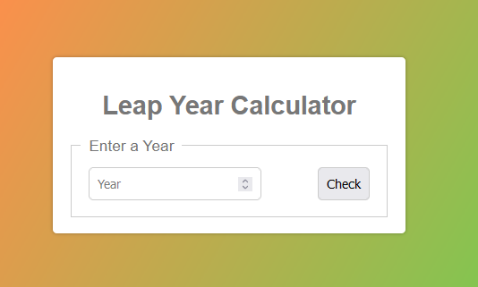
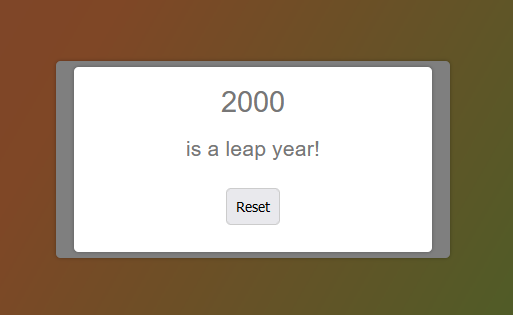

# Leap Year Calculator

## Description
This is a simple program that calculates whether a given year is a leap year or not. It is written in JavaScript.

## Setup
1. Clone this repository
2. Open the `index.html` file in your browser of choice

## Technologies Used
* HTML
* CSS
* JavaScript

## Known Bugs
* No known bugs at this time.

## Contact Information
* GitHub Link: [Aynjel](https://github.com/aynjel)

## Screenshots

